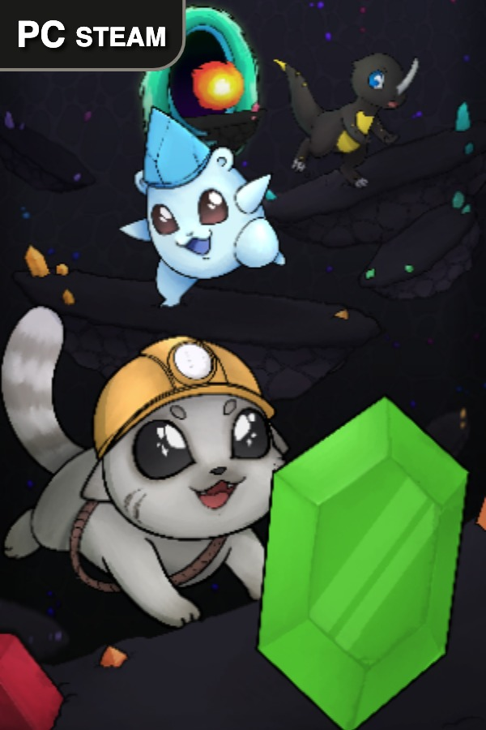
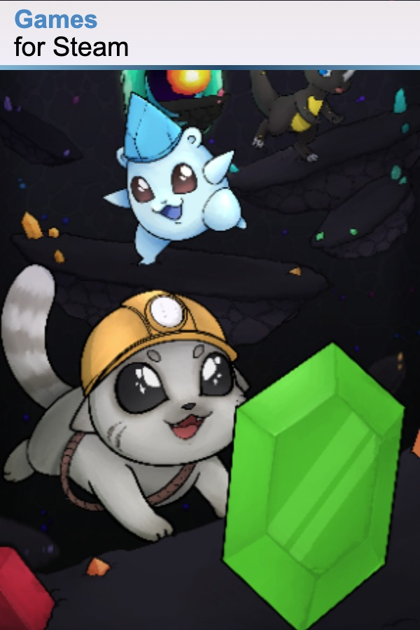
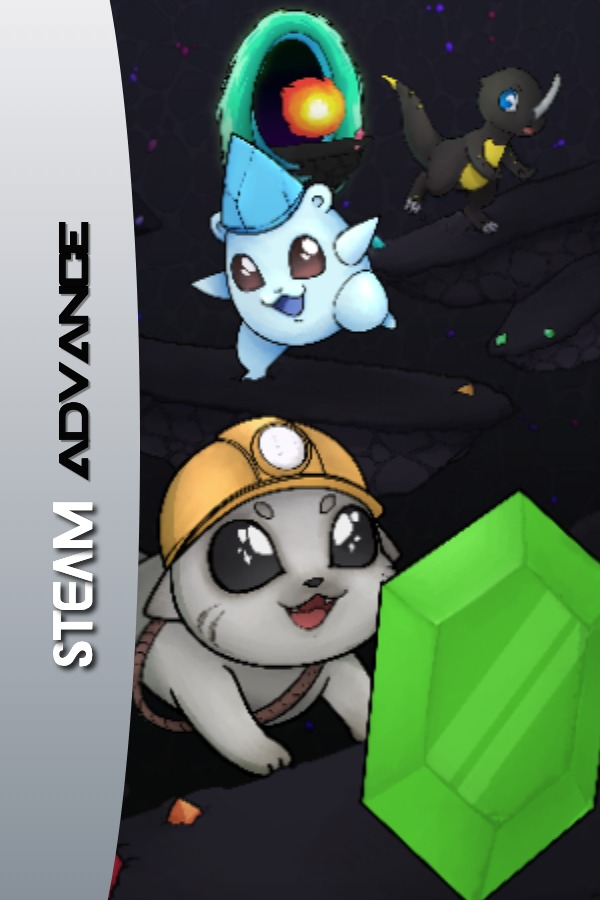
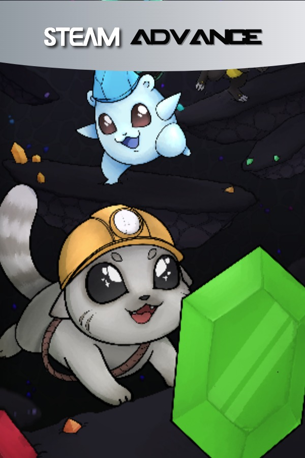
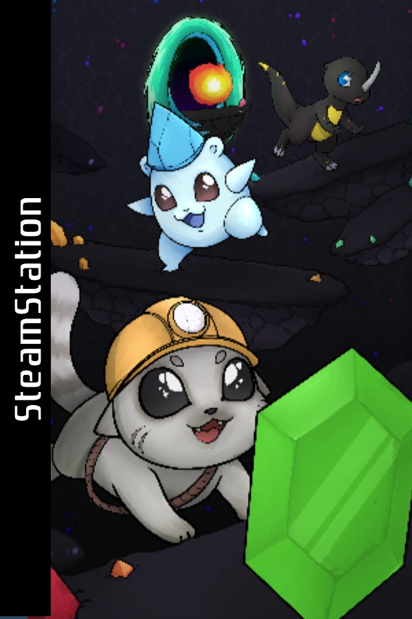
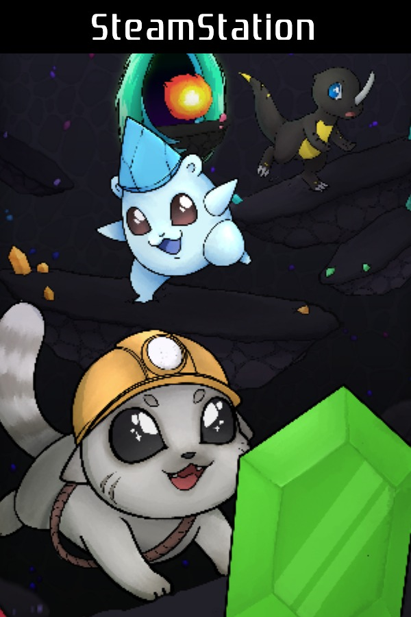
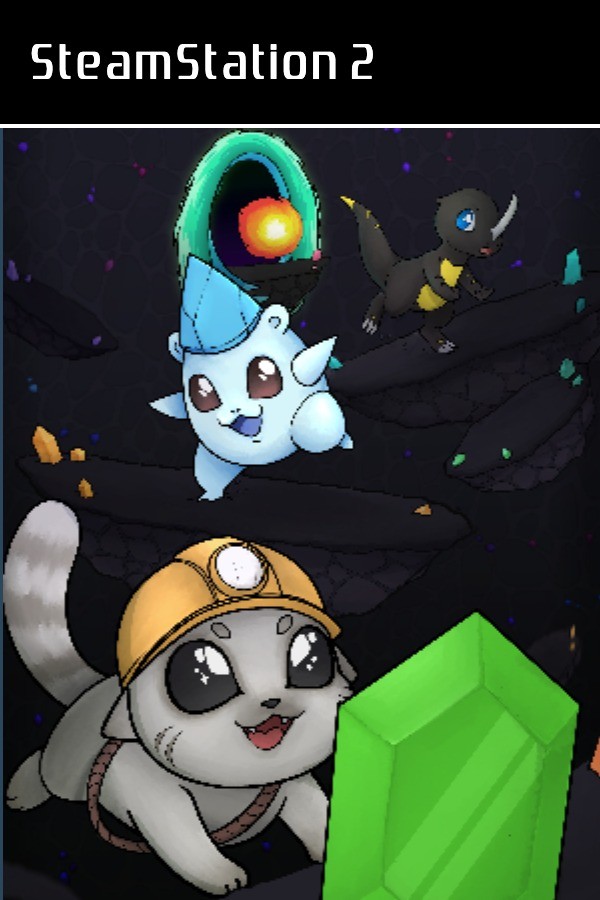
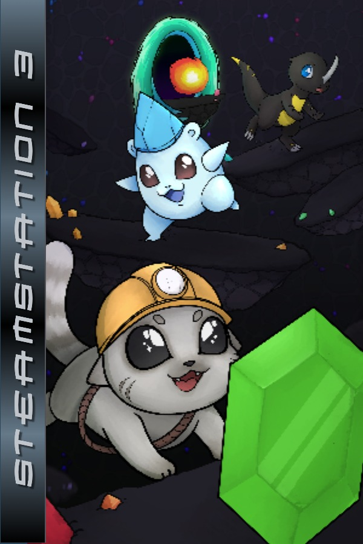
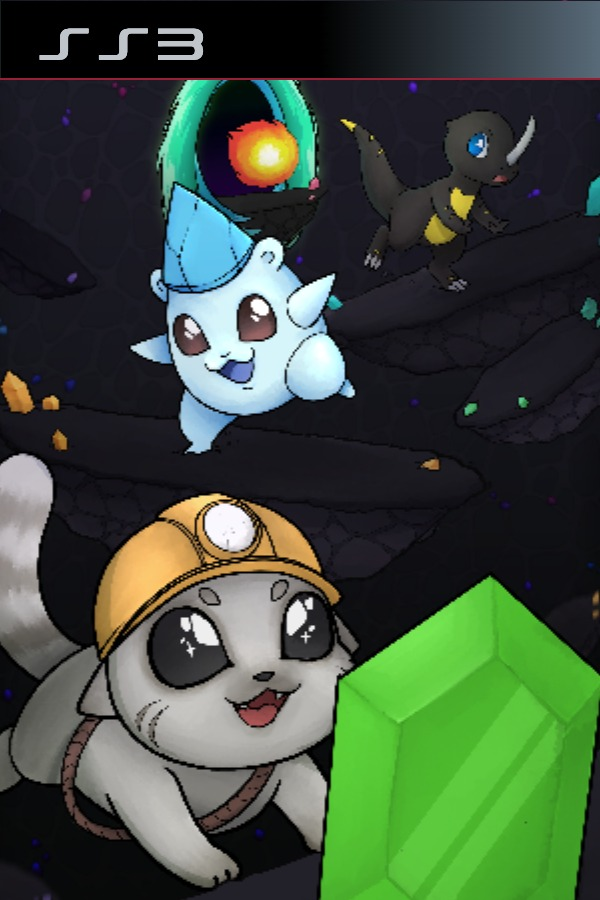

# Steam Cover Maker

## Overview

The Steam Cover Maker project was born out of the desire to enhance the visual appeal of non-Steam games added to the Steam library. Recognizing the need for a tool that could facilitate the creation of more engaging and visually appealing covers, this project was initiated. This tool aims to offer a simple and intuitive solution for gamers looking to personalize their library with better covers, thereby improving the overall user experience. We invite everyone to use and contribute to this project, potentially making it a staple in the customization of Steam libraries worldwide.

## Features

The Steam Cover Maker allows users to fully personalize their game covers with a variety of features and options. Here are some of the functionalities you can expect from this tool:

- **Custom Image Upload**: Users have the freedom to upload the specific image they want for the game cover.

- **Zoom and Position Adjustment**: Users can fine-tune the positioning of the image by adjusting the zoom level to fit their preference.

- **Label Selection**: The tool offers a variety of label styles to choose from, enhancing the personalization of your game cover. You can opt to go without a label or select from the following available styles:
  - Classic PC Game Cover
  - Modern PC Game Cover
  - Classic GBA Game Cover *(side label)*
  - Classic PS1 Game Cover *(side label)*
  - Classic PS2 Game Cover
  - Classic PS3 Game Cover *(side label)*
  - Modern PS3 Game Cover
  - And alternative formats with **top label** for:
    - GBA Game Cover
    - PS1 Game Cover

- **Customizable Label Text**: Beyond selecting the label style, users can further personalize it by adjusting the text displayed on the label.

- **Download Feature**: After tweaking and finalizing the design, users can easily download the ready image to use as their game cover.

## Screenshots

Explore some of the fantastic covers created using the Steam Cover Maker. You can find some examples below that demonstrate the versatility and personalization possibilities of this tool:

Feel free to explore more and create your unique game covers!

## Get Started

To start using the project, you can simply visit [my website](http://realafonso.com/steam-cover-maker/) to use the product directly from your web browser. It is designed to be user-friendly, making it easy for you to create the perfect steam cover!

If you wish to contribute to the project, please see the section below.

## How to Contribute

We welcome contributions from the community. Here are a few steps to get started:

1. **Fork the Repository**: Start by forking the repository to your GitHub account.

2. **Clone Your Fork**: Clone your forked repository to your local machine.

3. **Create a New Branch**: Before making changes, create a new branch.

4. **Make Your Changes**: Implement your changes and commit them with a descriptive message.

5. **Push Your Changes**: Push your changes to your GitHub repository.

6. **Create a Pull Request**: Create a pull request from your forked repository (from your new branch) to the main repository.

7. **Code Review**: Wait for your code to be reviewed. If there are any requested changes, implement them and push the changes to your branch.

8. **Merge**: Once your pull request is approved, it will be merged into the main branch of the project.

Please adhere to the code style and guidelines of the project. Make sure to test your changes thoroughly.

## License

This project is licensed under the [MIT License](LICENSE).

## Contact

If you have any questions or suggestions, feel free to open an issue or contact me on Twitter [@realAfonso](https://twitter.com/realAfonso/).

Thank you for your interest in the **Steam Cover Maker** project. We look forward to your contributions!
